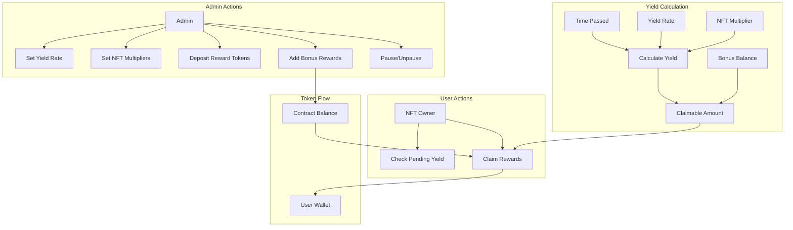

## NFT Yield Distributor Contract

The NFTYieldDistributor contract is a smart contract that enables yield distribution for NFT holders. It allows NFT owners to earn rewards based on a configurable yield rate and NFT-specific multipliers.

### Key Features

- Reward distribution based on time-based yield calculations
- NFT-specific multiplier system
- Bonus reward mechanism for individual NFTs
- Pausable functionality for emergency situations
- Owner-controlled yield rate and multiplier settings

#### Admin Actions

- Deploy contract with reward token and NFT contract addresses
- Configure yield rates and NFT-specific multipliers
- Deposit tokens for rewards
- Add bonus rewards for specific NFTs
- Control withdrawal access

#### Yield Calculation

- Time-based linear vesting
- Formula: Time Passed × Yield Rate × NFT Multiplier
- Bonus rewards added to final claimable amount

#### User Actions

- NFT holders can check pending yields
- Claim accumulated rewards + bonuses

#### Token Flow

- Admin deposits tokens to contract
- Contract distributes to NFT holders upon claim
- Each NFT can have different yield amounts while maintaining same rate

### Contract Functions

#### Core Functions
- `claim(uint256 _tokenId)`: Allows NFT owners to claim their accumulated rewards
- `calculatePendingYield(uint256 _tokenId)`: Calculates pending yield for a specific NFT

#### Administrative Functions
- `setYieldRate(uint256 _newRate)`: Updates the base yield rate
- `setNFTMultiplier(uint256 _tokenId, uint256 _multiplier)`: Sets multiplier for specific NFTs
- `addBonus(uint256 _tokenId, uint256 _amount)`: Adds bonus rewards for specific NFTs
- `pause()` and `unpause()`: Controls contract pause state

### Setup

1. Deploy with parameters:
   - Reward token address
   - NFT contract address
   - Initial yield rate

### Usage

# Deploy contract
npx hardhat run scripts/deploy.js --network <your-network>

# Run tests
npx hardhat test

